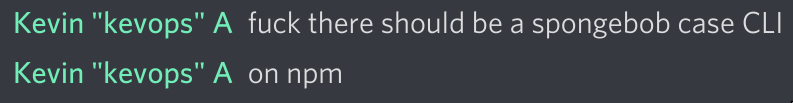

# speengbab

gEnERaTe teXt to moCk YoUR fRiENds



## Quckstart

#### With npm:

```
npm i speengbab
```

#### With yarn:

```
yarn add speengbab
```

#### Usage:

```javascript
import speeng from 'speengbab'

const mocking = speeng("Ghengis Khan had some pretty good ideas!") // GhEngiS KhAn HaD SomE PrETTy GoOd iDeaS!

```

#### Command line:

```
yarn global add speengbab

speeng hello world
```


```
npm install -g speengbab

speeng hello world
```
